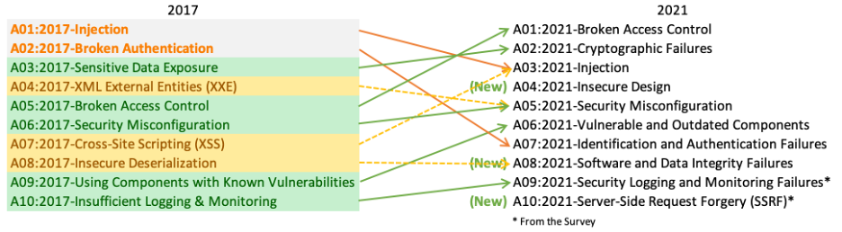

# 网络安全手册

[English Version](./README.md) | [中文版](./README_cn.md)

## 安全特性
### 基本特性

1. Confidentiality 保密性
2. Integrity 完整性
3. Availability 可用性

### 其他特性

4. Authenticity 真实性
5. Non-Repudiation 抗抵赖性
6. Accountability 可核查性
7. Reliability 可靠性

## 网络安全能力

1. 自动注销（ALOF）：产品在无人值守期间阻止非授权用户访问和使用的能力。
2. 审核（AUDT）：产品提供用户活动可被审核的能力。
3. 授权（AUTH）：产品确定用户已获授权的能力。
4. 节点鉴别（NAUT）：产品鉴别网络节点的能力。
5. 人员鉴别（PAUT）：产品鉴别授权用户的能力。
6. 连通性（CONN）：产品保证连通网络安全可控的能力。
7. 物理防护（PLOK）：产品提供防止非授权用户访问和使用的物理防护措施的能力。
8. 系统加固（SAHD）：产品通过固化措施对网络攻击和恶意软件的抵御能力。
9. 数据去标识化与匿名化（DIDT）：产品直接去除、匿名化数据所含个人信息的能力。
10. 数据完整性与真实性（IGAU）：产品确保数据未以非授权方式更改且来自创建者或提供者的能力。
11. 数据备份与灾难恢复（DTBK）：产品的数据、硬件或软件受到损坏或破坏后恢复的能力。
12. 数据存储保密性与完整性（STCF）：产品确保未授权访问不会损坏存储媒介所存数据保密性和完整性的能力。
13. 数据传输保密性（TXCF）：产品确保数据传输保密性的能力。
14. 数据传输完整性（TXIG）：产品确保数据传输完整性的能力。
15. 网络安全补丁升级（CSUP）：授权用户安装/升级产品网络安全补丁的能力。
16. 现成软件清单（SBOM）：产品为用户提供全部现成软件清单的能力。
17. 现成软件维护（RDMP）：产品在全生命周期中对现成软件提供网络安全维护的能力。
18. 网络安全使用指导（SGUD）：产品为用户提供网络安全使用指导的能力。
19. 网络安全特征配置（CNFS）：产品根据用户需求配置网络安全特征的能力。
20. 紧急访问（EMRG）：产品在预期紧急情况下允许用户访问和使用的能力。
21. 远程访问与控制（RMOT）：产品确保用户远程访问与控制（含远程维护与升级）的网络安全的能力。
22. 恶意软件探测与防护（MLDP）：产品有效探测、阻止恶意软件的能力。

## 2021 年 OWASP Top 10 安全风险

1. A01:2021-访问控制失效

排名从第五位上升；94% 的应用程序在测试中发现某种形式的访问控制失效。与访问控制失效相关的 34 个常见弱点枚举（CWEs）在应用程序中出现的频率比任何其他类别都高。

2. A02:2021-加密失败

排名上升一位至第二位，之前称为“敏感数据暴露”，这是一个广泛的症状描述，而非根本原因。本次更新的重点是与加密相关的失败，这些失败往往导致敏感数据泄露或系统受损。

3. A03:2021-注入

排名下降到第三位。94% 的应用程序在测试中发现某种形式的注入问题，与此类别相关的 33 个 CWEs 在应用程序中出现频率排名第二。本版本中，跨站脚本攻击（XSS）已被归入此类别。

4. A04:2021-设计不安全

这是 2021 年的新类别，聚焦于与设计缺陷相关的风险。如果行业想真正实现“左移”，需要更多地使用威胁建模、安全设计模式与原则，以及参考架构。

5. A05:2021-安全配置错误

从上一版的第六位上升；90% 的应用程序在测试中发现某种形式的配置错误。随着高度可配置软件的广泛使用，这一类别上升并不意外。之前的 XML 外部实体（XXE）类别已归入此类别。

6. A06:2021-易受攻击和过时组件

之前称为“使用已知漏洞的组件”，在 Top 10 社区调查中排名第二，但通过数据分析也有足够的数据进入 Top 10。此类别从 2017 年的第九位上升，是一个已知但难以测试和评估风险的问题。它是唯一一个未在相关 CWEs 中映射到任何常见漏洞（CVEs）的类别，因此默认情况下将漏洞和影响权重设置为 5.0 并计入分数。

7. A07:2021-身份验证和认证失败

之前称为“身份验证失效”，从第二位下降，现在包含更多与身份识别失败相关的 CWEs。此类别仍是 Top 10 的重要组成部分，但标准化框架的广泛可用性似乎有所帮助。

8. A08:2021-软件和数据完整性失效

这是 2021 年的新类别，重点关注在未经验证完整性的情况下对软件更新、关键数据和 CI/CD 流水线作出的假设。与此类别中 10 个 CWEs 相关的数据中，来自常见漏洞（CVEs）和常见漏洞评分系统（CVSS）的影响权重较高。2017 年的不安全反序列化已归入此更大的类别中。

9. A09:2021-安全日志记录和监控失败

之前称为“日志记录与监控不足”，根据行业调查（排名第三）从之前的第十位上升。此类别扩展到包含更多类型的失败，测试难度较大，在 CVE/CVSS 数据中代表性不足。然而，此类别中的失败可能直接影响可见性、事件警报和取证能力。

10. A10:2021-服务器端请求伪造（SSRF）

根据 Top 10 社区调查（排名第一）新增。数据显示此类别的发生率相对较低，但测试覆盖率和漏洞利用及影响潜力评分均高于平均水平。此类别代表了安全社区成员认为重要的场景，尽管目前数据中尚未充分体现其重要性。

## 2023 CWE 25 个最危险的软件漏洞

[2023 CWE Top 25](https://cwe.mitre.org/top25/archive/2023/2023_top25_list.html#top25list)

| 排名 | ID | 名称 | 分数 | KEV 中的 CVEs | 与 2022 年相比排名变化 |
| --- | --- | --- | --- | --- | --- |
| **1** | [CWE-787](https://cwe.mitre.org/data/definitions/787.html "Out-of-bounds Write") | 越界写入 (Out-of-bounds Write) | 63.72 | 70 | 0 |
| **2** | [CWE-79](https://cwe.mitre.org/data/definitions/79.html "Improper Neutralization of Input During Web Page Generation ('Cross-site Scripting')") | 网页生成期间输入未正确中和 ('跨站脚本') | 45.54 | 4 | 0 |
| **3** | [CWE-89](https://cwe.mitre.org/data/definitions/89.html "Improper Neutralization of Special Elements used in an SQL Command ('SQL Injection')") | SQL 命令中特殊元素未正确中和 ('SQL 注入') | 34.27 | 6 | 0 |
| **4** | [CWE-416](https://cwe.mitre.org/data/definitions/416.html "Use After Free") | 释放后使用 (Use After Free) | 16.71 | 44 | +3 |
| **5** | [CWE-78](https://cwe.mitre.org/data/definitions/78.html "Improper Neutralization of Special Elements used in an OS Command ('OS Command Injection')") | 操作系统命令中特殊元素未正确中和 ('命令注入') | 15.65 | 23 | +1 |
| **6** | [CWE-20](https://cwe.mitre.org/data/definitions/20.html "Improper Input Validation") | 输入验证不正确 | 15.50 | 35 | -2 |
| **7** | [CWE-125](https://cwe.mitre.org/data/definitions/125.html "Out-of-bounds Read") | 越界读取 (Out-of-bounds Read) | 14.60 | 2 | -2 |
| **8** | [CWE-22](https://cwe.mitre.org/data/definitions/22.html "Improper Limitation of a Pathname to a Restricted Directory ('Path Traversal')") | 路径名限制到受限目录不正确 ('路径遍历') | 14.11 | 16 | 0 |
| **9** | [CWE-352](https://cwe.mitre.org/data/definitions/352.html "Cross-Site Request Forgery (CSRF)") | 跨站请求伪造 (CSRF) | 11.73 | 0 | 0 |
| **10** | [CWE-434](https://cwe.mitre.org/data/definitions/434.html "Unrestricted Upload of File with Dangerous Type") | 危险类型文件的无限制上传 | 10.41 | 5 | 0 |
| **11** | [CWE-862](https://cwe.mitre.org/data/definitions/862.html "Missing Authorization") | 缺少授权 | 6.90 | 0 | +5 |
| **12** | [CWE-476](https://cwe.mitre.org/data/definitions/476.html "NULL Pointer Dereference") | 空指针解引用 | 6.59 | 0 | -1 |
| **13** | [CWE-287](https://cwe.mitre.org/data/definitions/287.html "Improper Authentication") | 身份验证不正确 | 6.39 | 10 | +1 |
| **14** | [CWE-190](https://cwe.mitre.org/data/definitions/190.html "Integer Overflow or Wraparound") | 整数溢出或环绕 | 5.89 | 4 | -1 |
| **15** | [CWE-502](https://cwe.mitre.org/data/definitions/502.html "Deserialization of Untrusted Data") | 不可信数据的反序列化 | 5.56 | 14 | -3 |
| **16** | [CWE-77](https://cwe.mitre.org/data/definitions/77.html "Improper Neutralization of Special Elements used in a Command ('Command Injection')") | 命令中使用的特殊元素未正确中和 ('命令注入') | 4.95 | 4 | +1 |
| **17** | [CWE-119](https://cwe.mitre.org/data/definitions/119.html "Improper Restriction of Operations within the Bounds of a Memory Buffer") | 内存缓冲区范围内操作限制不正确 | 4.75 | 7 | +2 |
| **18** | [CWE-798](https://cwe.mitre.org/data/definitions/798.html "Use of Hard-coded Credentials") | 使用硬编码凭据 | 4.57 | 2 | -3 |
| **19** | [CWE-918](https://cwe.mitre.org/data/definitions/918.html "Server-Side Request Forgery (SSRF)") | 服务器端请求伪造 (SSRF) | 4.56 | 16 | +2 |
| **20** | [CWE-306](https://cwe.mitre.org/data/definitions/306.html "Missing Authentication for Critical Function") | 关键功能缺少身份验证 | 3.78 | 8 | -2 |
| **21** | [CWE-362](https://cwe.mitre.org/data/definitions/362.html "Concurrent Execution using Shared Resource with Improper Synchronization ('Race Condition')") | 使用共享资源的并发执行中同步不正确 ('竞争条件') | 3.53 | 8 | +1 |
| **22** | [CWE-269](https://cwe.mitre.org/data/definitions/269.html "Improper Privilege Management") | 权限管理不正确 | 3.31 | 5 | +7 |
| **23** | [CWE-94](https://cwe.mitre.org/data/definitions/94.html "Improper Control of Generation of Code ('Code Injection')") | 代码生成的控制不正确 ('代码注入') | 3.30 | 6 | +2 |
| **24** | [CWE-863](https://cwe.mitre.org/data/definitions/863.html "Incorrect Authorization") | 授权不正确 | 3.16 | 0 | +4 |
| **25** | [CWE-276](https://cwe.mitre.org/data/definitions/276.html "Incorrect Default Permissions") | 默认权限不正确 | 3.16 | 0 | -5 |

## 实践和测试项目

* OWASP Benchmark:

 OWASP Benchmark 项目是一个 Java 测试套件，旨在评估自动化软件漏洞检测工具的准确性、覆盖范围和速度。如果无法对这些工具进行测量，就很难了解它们的优缺点，并进行相互比较。

* WebGoat:

WebGoat 是一个开源的 Web 应用程序，旨在教授 Web 应用程序安全。

* OWASP Juice Shop:

一个免费的开源不安全 Web 应用程序，易受 OWASP 前 10 名安全风险的攻击。

* DVWA:

Damn Vulnerable Web Application (DVWA) 是一个极度脆弱的 PHP/MySQL Web 应用程序。其主要目的是帮助安全专业人员在合法环境中测试其技能和工具，帮助 Web 开发人员更好地理解 Web 应用程序安全过程，并帮助学生和教师在受控的课堂环境中学习 Web 应用程序安全。

* Juliet Test suites:

    由 NIST 开发的一系列用于评估软件安全性的测试套件。
    * Juliet C++ 1.3
    * Juliet Java 1.3

## 方法

* [STRIDE](./doc/stride.md): STRIDE代表Spoofing（欺骗）、Tampering（篡改）、Repudiation（否认）、Information disclosure（信息泄露）、Denial of service（拒绝服务）和Elevation of privilege（权限提升）
* [Threat Modelling](./doc/threat-modelling.md): 威胁建模

## 术语表

* CVE (Common Vulnerabilities and Exposures)

  一份公开披露的计算机安全漏洞清单。

* CWE (Common Weakness Enumeration)

  软件弱点和漏洞的分类系统。

* OWASP (Open Web Application Security Project)

  一个致力于提高软件安全性的非盈利组织。

* Authentication 认证要求

  - 用户是不是通过认证的合法用户？

* Authorization 授权要求

 - 用户是不是经过授权的合法用户, 所访问的模块是在其权限范围之内的？

* Audit 可审查和追溯要求

  - 用户的访问和操作是不是可以审查和追溯的？

* 资产: 需要构建防御机制加以保护的关键实体

* 漏洞: 系统中可用来危害其安全性的地方

* 威胁: 利用潜在漏洞危害系统安全的潜在负面行为或事件

* 攻击: 在系统上执行的未经授权的破坏安全性的恶意行为

* 风险: 风险是威胁业务成功的诸多因素的组合。

比如，可以想象一个汽车窃贼（威胁代理）在停车场检查汽车（系统）是否有未上锁的门（漏洞），当他们找到一辆车时，他们打开车门（漏洞利用），并拿走里面的东西（影响）。

9. SAST: static application security testing (SAST)

  静态代码扫描，通过分析源代码，找出可能存在的安全漏洞。

10. DAST:  dynamic application security testing (DAST)

  动态代码扫描，通过运行程序，找出可能存在的安全漏洞。

## 参考资料
* [医疗器械网络安全注册审查指导原则（2022年修订版)](./refer/Medical-Device-Cybersecurity-Registration-Review-Guidelines.docx)
* [关于车辆网络安全审批及网络安全管理系统的统一规定](./refer/R155e.pdf)
* [GB/T 34943-2017 C++语言源代码漏洞测试规范](https://www.doc88.com/p-19229466192168.html)
* [GJB 8114-2013 C/C++语言编程安全子集](https://www.doc88.com/p-5631604036983.html)