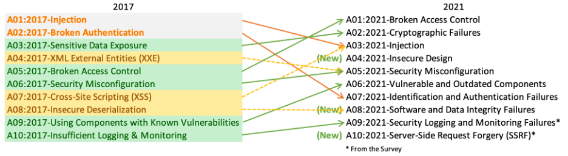

# Overview

## Features
### Basic Features

1. Confidentiality
2. Integrity
3. Availability

### Other Features

4. Authenticity
5. Non-Repudiation
6. Accountability
7. Reliability

## Capabilities
1. Automatic Logout (ALOF):

The ability of the product to prevent unauthorized users from accessing and using the product during unattended periods.

2. Audit (AUDT):

The ability of the product to provide user activities that can be audited.

3. Authorization (AUTH):

The ability of the product to determine that the user is authorized.

4. Node Authentication (NAUT):

The ability of the product to identify network nodes.

5. Personnel Authentication (PAUT):

The ability of the product to identify authorized users.

6. Connectivity (CONN):

The ability of the product to ensure that the connected network is secure and controllable.

7. Physical Protection (PLOK):

The ability of the product to provide physical protection measures to prevent unauthorized users from accessing and using the product.

8. System Hardening (SAHD):

The ability of the product to resist network attacks and malware through hardening measures.

9. Data De-identification and Anonymization (DIDT):

The ability of the product to directly remove and anonymize personal information contained in the data.

10. Data Integrity and Authenticity (IGAU):

The ability of the product to ensure that the data has not been changed in an unauthorized manner and comes from the creator or provider.

11. Data Backup and Disaster Recovery (DTBK):

The ability of the product to recover after the data, hardware or software is damaged or destroyed.

12. Data storage confidentiality and integrity (STCF):

The ability of the product to ensure that unauthorized access will not damage the confidentiality and integrity of data stored in the storage medium.

13. Data transmission confidentiality (TXCF):

The ability of the product to ensure the confidentiality of data transmission.

14. Data transmission integrity (TXIG):

The ability of the product to ensure the integrity of data transmission.

15. Cybersecurity patch upgrade (CSUP):

The ability of authorized users to install/upgrade product cybersecurity patches.

16. Off-the-shelf software list (SBOM):

The ability of the product to provide users with a list of all off-the-shelf software.

17. Off-the-shelf software maintenance (RDMP):

The ability of the product to provide cybersecurity maintenance for off-the-shelf software throughout its life cycle.

18. Cybersecurity usage guidance (SGUD):

The ability of the product to provide users with cybersecurity usage guidance.

19. Cybersecurity feature configuration (CNFS):

The ability of the product to configure cybersecurity features according to user needs.

20. Emergency access (EMRG):

The ability of the product to allow users to access and use in expected emergency situations.

21. Remote access and control (RMOT):

The ability of the product to ensure the network security of user remote access and control (including remote maintenance and upgrades).

22. Malware Detection and Protection (MLDP):

The product’s ability to effectively detect and block malware.

## OWASP TOP 10

1. A01:2021-Broken Access Control

It moves up from the fifth position; 94% of applications were tested for some form of broken access control. The 34 Common Weakness Enumerations (CWEs) mapped to Broken Access Control had more occurrences in applications than any other category.

2. A02:2021-Cryptographic Failures

It shifts up one position to #2, previously known as Sensitive Data Exposure, which was broad symptom rather than a root cause. The renewed focus here is on failures related to cryptography which often leads to sensitive data exposure or system compromise.

3. A03:2021-Injection

It slides down to the third position. 94% of the applications were tested for some form of injection, and the 33 CWEs mapped into this category have the second most occurrences in applications. Cross-site Scripting is now part of this category in this edition.

4. A04:2021-Insecure Design

It is a new category for 2021, with a focus on risks related to design flaws. If we genuinely want to “move left” as an industry, it calls for more use of threat modeling, secure design patterns and principles, and reference architectures.

5. A05:2021-Security Misconfiguration

It moves up from #6 in the previous edition; 90% of applications were tested for some form of misconfiguration. With more shifts into highly configurable software, it’s not surprising to see this category move up. The former category for XML External Entities (XXE) is now part of this category.

6. A06:2021-Vulnerable and Outdated Components

It was previously titled Using Components with Known Vulnerabilities and is #2 in the Top 10 community survey, but also had enough data to make the Top 10 via data analysis. This category moves up from #9 in 2017 and is a known issue that we struggle to test and assess risk. It is the only category not to have any Common Vulnerability and Exposures (CVEs) mapped to the included CWEs, so a default exploit and impact weights of 5.0 are factored into their scores.

7. A07:2021-Identification and Authentication Failures

It was previously Broken Authentication and is sliding down from the second position, and now includes CWEs that are more related to identification failures. This category is still an integral part of the Top 10, but the increased availability of standardized frameworks seems to be helping.

8. A08:2021-Software and Data Integrity Failures

It is a new category for 2021, focusing on making assumptions related to software updates, critical data, and CI/CD pipelines without verifying integrity. One of the highest weighted impacts from Common Vulnerability and Exposures/Common Vulnerability Scoring System (CVE/CVSS) data mapped to the 10 CWEs in this category. Insecure Deserialization from 2017 is now a part of this larger category.

9. A09:2021-Security Logging and Monitoring Failures

It was previously Insufficient Logging & Monitoring and is added from the industry survey (#3), moving up from #10 previously. This category is expanded to include more types of failures, is challenging to test for, and isn’t well represented in the CVE/CVSS data. However, failures in this category can directly impact visibility, incident alerting, and forensics.

10. A10:2021-Server-Side Request Forgery

It is added from the Top 10 community survey (#1). The data shows a relatively low incidence rate with above average testing coverage, along with above-average ratings for Exploit and Impact potential. This category represents the scenario where the security community members are telling us this is important, even though it’s not illustrated in the data at this time.

## 2023 CWE Top 25 Most Dangerous Software Weaknesses

[2023 CWE Top 25](https://cwe.mitre.org/top25/archive/2023/2023_top25_list.html#top25list)

| Rank | ID | Name | Score | CVEs in KEV | Rank Change vs. 2022 |
| --- | --- | --- | --- | --- | --- |
| **1** | [CWE-787](https://cwe.mitre.org/data/definitions/787.html "Out-of-bounds Write") | Out-of-bounds Write | 63.72 | 70 | 0 |
| **2** | [CWE-79](https://cwe.mitre.org/data/definitions/79.html "Improper Neutralization of Input During Web Page Generation ('Cross-site Scripting')") | Improper Neutralization of Input During Web Page Generation ('Cross-site Scripting') | 45.54 | 4 | 0 |
| **3** | [CWE-89](https://cwe.mitre.org/data/definitions/89.html "Improper Neutralization of Special Elements used in an SQL Command ('SQL Injection')") | Improper Neutralization of Special Elements used in an SQL Command ('SQL Injection') | 34.27 | 6 | 0 |
| **4** | [CWE-416](https://cwe.mitre.org/data/definitions/416.html "Use After Free") | Use After Free | 16.71 | 44 | +3 |
| **5** | [CWE-78](https://cwe.mitre.org/data/definitions/78.html "Improper Neutralization of Special Elements used in an OS Command ('OS Command Injection')") | Improper Neutralization of Special Elements used in an OS Command ('OS Command Injection') | 15.65 | 23 | +1 |
| **6** | [CWE-20](https://cwe.mitre.org/data/definitions/20.html "Improper Input Validation") | Improper Input Validation | 15.50 | 35 | -2 |
| **7** | [CWE-125](https://cwe.mitre.org/data/definitions/125.html "Out-of-bounds Read") | Out-of-bounds Read | 14.60 | 2 | -2 |
| **8** | [CWE-22](https://cwe.mitre.org/data/definitions/22.html "Improper Limitation of a Pathname to a Restricted Directory ('Path Traversal')") | Improper Limitation of a Pathname to a Restricted Directory ('Path Traversal') | 14.11 | 16 | 0 |
| **9** | [CWE-352](https://cwe.mitre.org/data/definitions/352.html "Cross-Site Request Forgery (CSRF)") | Cross-Site Request Forgery (CSRF) | 11.73 | 0 | 0 |
| **10** | [CWE-434](https://cwe.mitre.org/data/definitions/434.html "Unrestricted Upload of File with Dangerous Type") | Unrestricted Upload of File with Dangerous Type | 10.41 | 5 | 0 |
| **11** | [CWE-862](https://cwe.mitre.org/data/definitions/862.html "Missing Authorization") | Missing Authorization | 6.90 | 0 | +5 |
| **12** | [CWE-476](https://cwe.mitre.org/data/definitions/476.html "NULL Pointer Dereference") | NULL Pointer Dereference | 6.59 | 0 | -1 |
| **13** | [CWE-287](https://cwe.mitre.org/data/definitions/287.html "Improper Authentication") | Improper Authentication | 6.39 | 10 | +1 |
| **14** | [CWE-190](https://cwe.mitre.org/data/definitions/190.html "Integer Overflow or Wraparound") | Integer Overflow or Wraparound | 5.89 | 4 | -1 |
| **15** | [CWE-502](https://cwe.mitre.org/data/definitions/502.html "Deserialization of Untrusted Data") | Deserialization of Untrusted Data | 5.56 | 14 | -3 |
| **16** | [CWE-77](https://cwe.mitre.org/data/definitions/77.html "Improper Neutralization of Special Elements used in a Command ('Command Injection')") | Improper Neutralization of Special Elements used in a Command ('Command Injection') | 4.95 | 4 | +1 |
| **17** | [CWE-119](https://cwe.mitre.org/data/definitions/119.html "Improper Restriction of Operations within the Bounds of a Memory Buffer") | Improper Restriction of Operations within the Bounds of a Memory Buffer | 4.75 | 7 | +2 |
| **18** | [CWE-798](https://cwe.mitre.org/data/definitions/798.html "Use of Hard-coded Credentials") | Use of Hard-coded Credentials | 4.57 | 2 | -3 |
| **19** | [CWE-918](https://cwe.mitre.org/data/definitions/918.html "Server-Side Request Forgery (SSRF)") | Server-Side Request Forgery (SSRF) | 4.56 | 16 | +2 |
| **20** | [CWE-306](https://cwe.mitre.org/data/definitions/306.html "Missing Authentication for Critical Function") | Missing Authentication for Critical Function | 3.78 | 8 | -2 |
| **21** | [CWE-362](https://cwe.mitre.org/data/definitions/362.html "Concurrent Execution using Shared Resource with Improper Synchronization ('Race Condition')") | Concurrent Execution using Shared Resource with Improper Synchronization ('Race Condition') | 3.53 | 8 | +1 |
| **22** | [CWE-269](https://cwe.mitre.org/data/definitions/269.html "Improper Privilege Management") | Improper Privilege Management | 3.31 | 5 | +7 |
| **23** | [CWE-94](https://cwe.mitre.org/data/definitions/94.html "Improper Control of Generation of Code ('Code Injection')") | Improper Control of Generation of Code ('Code Injection') | 3.30 | 6 | +2 |
| **24** | [CWE-863](https://cwe.mitre.org/data/definitions/863.html "Incorrect Authorization") | Incorrect Authorization | 3.16 | 0 | +4 |
| **25** | [CWE-276](https://cwe.mitre.org/data/definitions/276.html "Incorrect Default Permissions") | Incorrect Default Permissions | 3.16 | 0 | -5 |

## Practice and testing projects
* [OWASP Benchmark](https://github.com/OWASP/Benchmark): The OWASP Benchmark Project is a Java test suite designed to evaluate the accuracy, coverage, and speed of automated software vulnerability detection tools. Without the ability to measure these tools, it is difficult to understand their strengths and weaknesses, and compare them to each other.
* [WebGoat](https://github.com/WebGoat/WebGoat): WebGoat is an open-source web application designed to teach web application security.
* [OWASP Juice Shop](https://github.com/bkimminich/juice-shop): A free, open-source insecure web application vulnerable to OWASP top 10 security risks.
* [DVWA](https://github.com/digininja/DVWA): Damn Vulnerable Web Application (DVWA) is a PHP/MySQL web application that is damn vulnerable. Its main goal is to be an aid for security professionals to test their skills and tools in a legal environment, help web developers better understand the processes of securing web applications and to aid both students & teachers to learn about web application security in a controlled class room environment.
* [Juliet Test suites](https://samate.nist.gov/SARD/test-suites)
  - [Juliet C++ 1.3](https://samate.nist.gov/SARD/test-suites/112)
  - [Juliet Java 1.3](https://samate.nist.gov/SARD/test-suites/111)

## Methods

* [STRIDE](stride.md): Spoofing, Tampering, Repudiation, Information disclosure, Denial of service, Elevation of privilege
* [Threat Modelling](threat_modelling.md)

## Glossary

* CVE (Common Vulnerabilities and Exposures)
* CWE (Common Weakness Enumeration)
* OWASP (Open Web Application Security Project)
* Authentication: Authentication requirements  

  - Is the user a legitimate user who has been authenticated?  

* Authorization: Authorization requirements  

  - Is the user a legitimate user who has been authorized, and is the accessed module within their permission scope?  

* Audit: Auditing and traceability requirements  

  - Can the user's access and operations be audited and traced?  

* Asset: Critical entities that need defensive mechanisms to protect them  

* Vulnerability: Weak points in a system that could compromise its security  

* Threat: Potential negative actions or events that exploit vulnerabilities to compromise system security  

* Attack: Unauthorized malicious actions executed on a system to breach its security  

* Risk: A combination of factors that threaten the success of a business.  

  For example, imagine a car thief (threat actor) checking cars (system) in a parking lot for unlocked doors (vulnerabilities). When they find one, they open the door (exploit the vulnerability) and steal items inside (impact).  

* SAST: Static Application Security Testing (SAST)  

  - Static code scanning, which identifies potential security vulnerabilities by analyzing source code.  

* DAST: Dynamic Application Security Testing (DAST)  

  - Dynamic code scanning, which identifies potential security vulnerabilities by running the application.  

## Tools  
* [Burp Suite](https://portswigger.net/burp)  
* [OWASP ZAP](https://www.zaproxy.org/)  
* [Kali Linux](https://www.kali.org/)  
* [Dependency-Check](https://jeremylong.github.io/DependencyCheck/)  
* [Talisman](https://github.com/thoughtworks/talisman)  

## Reference
* [Medical-Device-Cybersecurity-Registration-Review-Guidelines](https://github.com/walterfan/security-handbook/blob/master/refer/Medical-Device-Cybersecurity-Registration-Review-Guidelines.docx)
* [Vehicles cyber security](https://github.com/walterfan/security-handbook/blob/master/refer/R155e.pdf)
* [NIST Computer Security Resource Center](https://csrc.nist.gov/projects)