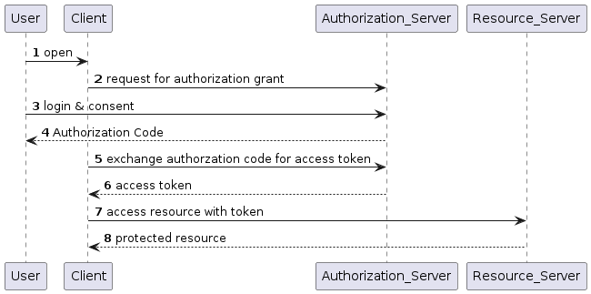

# OAuth2
## Problem

核心问题: "我怎样才能允许应用程序访问我的数据而又不必向其提供密码?"

OAuth 是 REST/API 的委托授权框架。它允许应用获得对用户数据的有限访问权限（范围），而无需泄露用户的密码。它将身份验证与授权分离开来，并支持针对不同设备功能的多种用例。它支持服务器到服务器的应用、基于浏览器的应用、移动/本机应用以及控制台/电视。

您可以将其视为酒店钥匙卡，但适用于应用程序。如果您有酒店钥匙卡，则可以进入您的房间。如何获取酒店钥匙卡？您必须在前台进行身份验证才能获得它。通过身份验证并获取钥匙卡后，您可以访问整个酒店的资源。

简单来说，OAuth 是 (以照片打印程序 PhotoApp 为例)

* 应用程序向用户请求授权:
  - PhotoApp 向  Alice 请求要访问 Alice 的照片
* 用户授权App并提供证明:
  - PhotoApp 向 Alice 申请我授权访问她的 QQ 相册, 而 Alice 授权 PhotoApp 这一请求 
* 应用程序向服务器提供授权证明以获取令牌:
  - PhotoApp 向 QQ 相册提供 Alice 的授权证明
* Token 仅限于访问用户为特定应用授权的内容
  - QQ 相册发给 PhotoApp 访问 Alice 相册图片的访问令牌 access token

## OAuth 流程中的参与者

1. 资源所有者 Resource Owner(RO)：
拥有资源服务器中的数据。例如，Alice 是她的 QQ 相册的资源所有者。

2. 资源服务器 Resource Server (RS)：
存储应用程序想要访问的数据的 API, 例如 QQ 相册的 API

3. 客户端 Client：
想要访问你的数据的应用程序, 例如相片打印程序 PhotoApp

4. 授权服务器 Authorization Server (AS)：
OAuth 的主要引擎, 例如 QQ 相册的授权模块


## OAuth 流程

OAuth 定义了一个基本框架, 也定义了一些典型流程, 可是到底用哪一种流程呢?

OAuth 2.0 提供了不同的授权流程（OAuth Flows），根据不同的应用场景，选择合适的流程至关重要。

OAuth 2.0 的授权流程好比不同的“过门禁”方式，不同的场景用不同的方式刷脸或刷卡。

### 1. Authorization Code Flow（授权码流程）

 场景： 适用于有服务端的应用（Web 应用、大型系统）。

* 角色分配：
你的前端像是“保安”，用户通过保安提交申请，真正的决策是在后端完成的。



```
@startuml

participant User
participant Client
participant Authorization_Server as AS
participant Resource_Server as RS

autonumber

User ->Client : open
Client -> AS: request for authorization grant
User -> AS: login & consent
AS --> User: Authorization Code
Client -> AS: exchange authorzation code for access token
AS --> Client: access token
Client -> RS: access resource with token
RS --> Client: protected resource
@enduml
```

* 流程图解：
 1. 用户在客户端登录，授权服务器返回一个短期有效的授权码（Authorization Code）。

 2. 客户端后端（服务器）用这个授权码，向授权服务器换取长时间有效的访问令牌（Access Token）。

 3. 客户端用令牌访问资源。
 
* 优点：
    * 授权码只在前端使用一次，令牌保存在后端，不易泄露。
    * 非常安全

* 实现方法（FastAPI 示例）：

使用第三方库（如 Authlib）与提供 OAuth 服务的平台（如 Google, GitHub）集成。

例如

```
https://accounts.google.com/o/oauth2/v2/auth?
 response_type=code&
 client_id=your_client_id&
 scope=profile%20contacts&
 redirect_uri=https%3A//oauth2.example.com/code

```

示例如下：
```python
from fastapi import FastAPI
from authlib.integrations.starlette_client import OAuth

app = FastAPI()
oauth = OAuth()

# 注册 OAuth 客户端
oauth.register(
    name='github',
    client_id='your_client_id',
    client_secret='your_client_secret',
    authorize_url='https://github.com/login/oauth/authorize',
    access_token_url='https://github.com/login/oauth/access_token',
)

@app.get('/login')
async def login(request):
    redirect_uri = "http://localhost:8000/authorize"
    return await oauth.github.authorize_redirect(request, redirect_uri)

@app.get('/authorize')
async def authorize(request):
    token = await oauth.github.authorize_access_token(request)
    user = await oauth.github.parse_id_token(request, token)
    return {"user": user}

```

### 2. Implicit Flow（隐式流程）

 场景： 适用于单页面应用（SPA）和纯前端应用。

* 角色分配：
用户直接获取令牌，不需要后端参与。

* 流程图解：
 1. 用户通过前端登录，直接从授权服务器获取访问令牌（Access Token）。
 2. 前端用访问令牌访问资源。
 
* 优点：
  * 无需后端服务器，适合轻量应用。
* 缺点：
  * 令牌直接暴露在前端，安全性较低。
* 实现方法：
使用 JavaScript 库（如 oidc-client）直接与授权服务器交互。

### 3. Client Credentials Flow（客户端凭据流程）

场景： 适用于后端服务器之间的通信，或者需要访问自己资源的服务。

* 角色分配：
服务器自己给自己授权，用户完全不参与。

* 流程图解：
  1. 客户端直接向授权服务器申请访问令牌（Access Token），提供客户端 ID 和密钥。
  2. 使用令牌访问资源。

* 优点：
  * 简单高效。
  * 安全性较高，因为只在服务器上使用。

* 实现方法（FastAPI 示例）：

```python
import requests

# 模拟客户端向授权服务器申请令牌
response = requests.post(
    'https://auth.server.com/token',
    data={
        'grant_type': 'client_credentials',
        'client_id': 'your_client_id',
        'client_secret': 'your_client_secret',
    }
)
token = response.json()["access_token"]
print("Access Token:", token)
```


4. Resource Owner Password Credentials Flow（资源所有者密码凭据流程）

场景： 适用于你完全信任的客户端（内部应用，老旧系统）。

* 角色分配：
用户直接把用户名和密码交给客户端。

* 流程图解：
 1. 用户直接输入用户名和密码到客户端。
 2. 客户端用这些信息向授权服务器申请访问令牌（Access Token）。
 3. 使用令牌访问资源。
 
* 优点：
  * 简单直接。
* 缺点：
  * 用户的密码需要交给客户端，安全性很低。

* 实现方法（FastAPI 示例）：

利用 OAuth2PasswordBearer，如下：
```python
@app.post('/token')
async def login(form_data: OAuth2PasswordRequestForm = Depends()):
    # 检查用户登录信息
    if form_data.username == "user1" and form_data.password == "password1":
        token = create_access_token({"sub": form_data.username})
        return {"access_token": token, "token_type": "bearer"}
    raise HTTPException(status_code=400, detail="Invalid credentials")
```


### 5. Device Code Flow（设备代码流程）

 场景： 适用于输入受限的设备（如智能电视、IoT 设备）。

* 角色分配：
设备和用户配合完成授权。

* 流程图解：
 1. 设备向授权服务器申请一个设备代码，并提供用户操作的 URL。
 2. 用户用其他设备（比如手机或电脑）访问 URL，完成登录和授权。
 3. 设备通过轮询获取访问令牌（Access Token）。

* 优点：
  * 适合没有键盘的设备。

* 实现方法：
使用 OAuth 设备授权库（如 requests-oauthlib）。

### 选哪个流程？

* Web 应用：用 Authorization Code Flow，最安全。
* 单页面应用（SPA）：用 Implicit Flow，灵活方便。
* 服务器间通信：用 Client Credentials Flow，效率高。
* 老旧应用：用 Password Flow，仅限你信得过的。
* 智能设备：用 Device Code Flow，用户体验好。

通过这些 Flows，OAuth2 提供了灵活的工具集，能满足各种场景需求。记住，安全是第一位，选对了流程，才能让你的应用既方便又稳如磐石！🔒


## Reference
