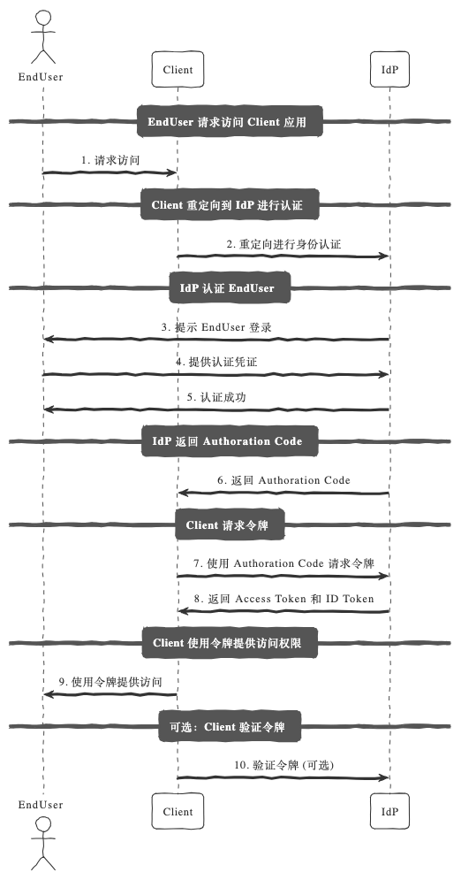

# OpenID Connect

## OpenID Connect（OIDC）是什么？

> OpenID Connect (OIDC) is an identity layer built on top of the OAuth 2.0 framework. It allows third-party applications to verify the identity of the end-user and to obtain basic user profile information. OIDC uses JSON web tokens (JWTs), which you can obtain using flows conforming to the OAuth 2.0 specifications.

* OpenID vs. OAuth2

While OAuth 2.0 is about resource access and sharing, OIDC is about user authentication. Its purpose is to give you one login for multiple sites. Each time you need to log in to a website using OIDC, you are redirected to your OpenID site where you log in, and then taken back to the website.

For example, if you chose to sign in to OpenAI using your Google account then you used OIDC. Once you successfully authenticate with Google and authorize OpenAI to access your information, Google sends information back to OpenAI about the user and the authentication performed. This information is returned in a JWT. You'll receive an access token and if requested, an ID token.

* OpenID and JWTs

JWTs contain claims, which are statements (such as name or email address) about an entity (typically, the user) and additional metadata. The OpenID Connect specification defines a set of standard claims. The set of standard claims include name, email, gender, birth date, and so on.

However, if you want to capture information about a user and there currently isn't a standard claim that best reflects this piece of information, you can create custom claims and add them to your tokens.


OpenID Connect 是 OAuth 2.0 的认证层。如果说 OAuth 2.0 是一张“授权卡”，让应用拿到访问资源的权限，那么 OIDC 就是这张卡的身份证明，让应用知道用户到底是谁。

* OAuth 2.0 的目标： 允许应用“访问资源”。
* OIDC 的目标： 允许应用“确认用户身份”。

在 OAuth 2.0 的基础上，OIDC 增加了一些内容，最重要的是引入了一个叫 ID Token 的概念，它就像是用户的电子身份证。

## OIDC 的核心角色

OIDC 的角色跟 OAuth 2.0 差不多，但有一些认证层的扩展：

1. 终端用户（End User）
就是我们这些使用应用的人。

2. 客户端（Client / Relying Party, RP）
依赖 OIDC 提供认证服务的应用，比如你的 App 或网站。

3. 授权服务器（Authorization Server / OpenID Provider, OP/IDP）
提供 OIDC 服务的服务器，比如 Google、GitHub、Okta。

4. 资源服务器（Resource Server）
持有资源的服务器，比如 Google Drive 等。

## OIDC 的主要功能

1. 身份验证： 应用可以通过 ID Token 确认用户身份。
2. 授权： 应用可以用 Access Token 访问资源。
3. 用户信息： 提供接口获取用户的基本信息（如用户名、邮箱等）。

## OIDC 的主要流程

OIDC 在 OAuth 2.0 的基础上增加了一些新概念，最常见的流程是 Authorization Code Flow。

流程图解：

1. 用户访问客户端应用，点击“用 Google 登录”。
2. 客户端将用户重定向到授权服务器（Google）。
3. 用户在授权服务器登录，并同意授予客户端权限。
4. 授权服务器返回一个短期有效的授权码（Authorization Code）。
5. 客户端用授权码向授权服务器请求访问令牌（Access Token）和身份令牌（ID Token）。
6. 客户端用访问令牌访问资源服务器，用 ID Token 确认用户身份。




## 核心区别：ID Token

* ID Token 是 JWT 格式的令牌，包含用户的身份信息（比如 sub, name, email 等）。
* 通过 ID Token，客户端能验证用户的身份，而不需要自己管理用户名和密码。

## OIDC 的应用场景

1. 单点登录（SSO）：
用户只需登录一次，就可以访问多个应用，比如 Google 登录。

2. 第三方登录：
允许用户用 Google、GitHub、Facebook 等账号登录应用，无需注册。

3. 跨平台用户认证：
一个用户可以在移动端、桌面端和 Web 应用上使用同一个身份。

4. 增强 OAuth 2.0 的安全性：
在授权之外，增加用户身份认证功能。

## OIDC 的实现方法

下面我们用 FastAPI 来实现一个简单的 OIDC 流程，通过 GitHub 作为 OpenID Provider：

1. 安装依赖
```
pip install fastapi uvicorn authlib python-dotenv
```

2. 配置环境变量

在 .env 文件中添加你的 GitHub 应用信息：

```
GITHUB_CLIENT_ID=your_client_id
GITHUB_CLIENT_SECRET=your_client_secret
GITHUB_REDIRECT_URI=http://localhost:8000/auth/callback
```

3. 核心代码

```python
from fastapi import FastAPI, Depends, Request
from authlib.integrations.starlette_client import OAuth
from starlette.responses import RedirectResponse
from dotenv import load_dotenv
import os

# 加载环境变量
load_dotenv()

app = FastAPI()

# OAuth 配置
oauth = OAuth()
oauth.register(
    name="github",
    client_id=os.getenv("GITHUB_CLIENT_ID"),
    client_secret=os.getenv("GITHUB_CLIENT_SECRET"),
    authorize_url="https://github.com/login/oauth/authorize",
    access_token_url="https://github.com/login/oauth/access_token",
    client_kwargs={"scope": "openid email profile"},
)

# 登录路由
@app.get("/login")
async def login(request: Request):
    redirect_uri = os.getenv("GITHUB_REDIRECT_URI")
    return await oauth.github.authorize_redirect(request, redirect_uri)

# 授权回调路由
@app.get("/auth/callback")
async def auth_callback(request: Request):
    # 获取 Access Token 和 ID Token
    token = await oauth.github.authorize_access_token(request)
    user_info = token.get("userinfo")  # 从 ID Token 获取用户信息
    return {"user": user_info}

# 受保护资源
@app.get("/protected")
async def protected_route():
    return {"message": "You have accessed a protected resource!"}
```

### 测试流程

1. 启动应用：
```
uvicorn main:app --reload
```

2. 打开浏览器访问 /login：
* 用户会被重定向到 GitHub 登录页面。
* 登录成功后，GitHub 会跳转到回调地址 /auth/callback。

3. 在回调路由中，返回用户的身份信息，例如：

```
{
  "user": {
    "sub": "12345",
    "email": "user@example.com",
    "name": "John Doe"
  }
}
```


总结：OAuth 2.0 和 OIDC 的区别

功能 | OAuth 2.0 | OpenID Connect
---|---|---
目标 | 授权访问资源 | 认证用户身份
主要令牌 | Access Token | ID Token
场景 | 资源授权|  单点登录，第三方登录

OIDC 是 OAuth 2.0 的“增强版”，专注于身份认证，尤其适合需要跨平台、跨应用的场景。如果你想让用户“用 Google 登录”，那就是它的最佳用途！

