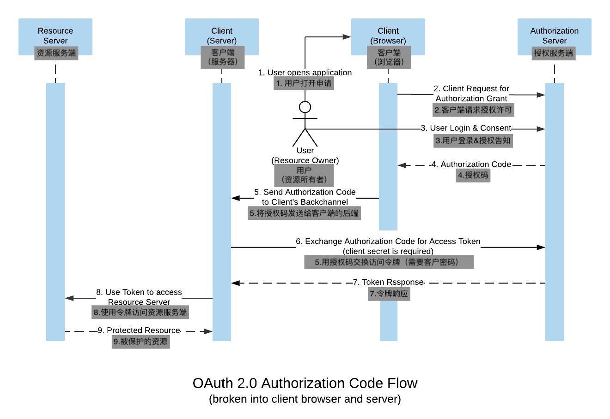

# FAQ

## 什么是 OAuth2

OAuth2 是一种 授权协议，用来安全地让一个应用（客户端）访问另一个应用（资源服务器）上的资源，而不用直接暴露用户的用户名和密码。

简单理解

	1.	用户（资源拥有者）：允许某应用访问自己的数据（比如允许某个第三方应用访问你的 GitHub 仓库）。
	2.	客户端（第三方应用）：想要访问用户数据的应用。
	3.	授权服务器：负责验证用户身份并发放访问令牌（Access Token）。
	4.	资源服务器：保存用户数据的服务（如 GitHub）。

流程总结

	1.	用户登录授权服务器，同意客户端访问数据。
	2.	授权服务器颁发令牌（Token）给客户端。
	3.	客户端用令牌向资源服务器请求数据。
	4.	资源服务器验证令牌并返回数据。

核心特点

	•	安全：用户不用暴露密码给第三方应用。
	•	灵活：支持多种授权模式（如授权码模式、密码模式）。

一句话总结：OAuth2 就像是旅馆给你的一张有过期时间的门卡，而不是直接给你钥匙或门锁密码。

## 什么是 OpenID Connect?

OpenID Connect 是一种基于 OAuth 2.0 规范框架（IETF RFC 6749 和 6750）的可互操作身份验证协议。它简化了基于授权服务器执行的身份验证来验证用户身份的方式，并以可互操作和类似 REST 的方式获取用户个人资料信息。

OpenID Connect 使应用程序和网站开发人员能够启动登录流程，并在基于 Web、移动和 JavaScript 的客户端上接收有关用户的可验证断言。并且该规范套件可扩展以支持一系列可选功能，例如身份数据加密、OpenID 提供商发现和会话注销。

对于开发人员来说，它为“当前使用所连接浏览器或移动应用的人的身份是什么？”这个问题提供了一个安全且可验证的答案。最重要的是，它消除了设置、存储和管理密码的责任，而这些责任通常与基于凭证的数据泄露有关。

* OAuth2 是一种授权机制，让你可以安全地分享信息而不用暴露你的密码。
* JWT 是一种传递信息的方式，它确保信息在传递过程中的安全性和完整性。
* OpenID Connect 是一种身份认证协议，它利用OAuth2来让你在不同网站上快速登录，而不需要每次都输入账号密码。


## JWT是如何保证信息传输的安全的？

JWT（JSON Web Tokens）为了保证信息传输的安全，主要依赖于以下几个方面：

1. **编码**：JWT由三部分组成，用点（`.`）分隔，分别是Header（头部）、Payload（负载）和Signature（签名）。Header通常包含令牌的类型（即JWT）和所使用的签名算法，如HMAC SHA256或RSA。Payload则包含所谓的“声明”（Claims），这些是关于实体（通常是用户）和其他数据的声明。

2. **签名**：为了确保JWT在传输过程中没有被篡改，以及确保发送方的身份，JWT可以被签名。签名是在Header和Payload使用秘钥和Header中指定的算法进行加密得到的。接收方可以用相同的秘钥和算法来验证签名，如果签名验证成功，说明JWT在传输过程中未被篡改，且发送方是可信的。

3. **秘钥**：签名过程中使用的秘钥（Secret）必须保密，只有发送方和接收方知道。如果秘钥泄露，那么JWT的安全性就会受到威胁，因为任何人都可以伪造签名。

4. **HTTPS**：为了保证JWT在传输过程中不被窃听，应该通过HTTPS协议传输JWT，这样即使数据在传输过程中被截获，由于加密，攻击者也无法读取内容。

5. **声明的验证**：JWT中的声明可以包含各种信息，比如发行者（iss）、过期时间（exp）、主题（sub）等。接收方需要验证这些声明，以确保JWT是有效的，比如检查JWT是否过期。

6. **防止重放攻击**：可以通过在Payload中包含一个唯一的、一次性使用的Nonce或者JWT ID，并在服务器端进行跟踪，来防止JWT被重放。

7. **算法强制**：服务提供方可以强制使用特定的签名算法，比如只接受RS256（RSA签名算法）而不接受HS256（HMAC签名算法），因为前者更难被破解。

通过这些机制，JWT能够在网络中安全地传输信息，确保信息的完整性和认证的安全性。然而，需要注意的是，JWT本身并不提供加密功能，它只保证数据的完整性和认证。如果需要保证数据的机密性，那么还需要额外的加密措施。


## 为什么用授权码来交换令牌？

访问令牌是唯一能用于访问资源服务端上的数据的东西，而不是授权码。所以为什么在客户端实际需要访问令牌的情况下，将response_type设置成授权码呢？这是因为这样做能使 OAuth 流程非常安全, 让 access token 只在服务端使用，而不在客户端使用。

因为在 OAuth2.0 中，访问令牌（Access Token）是客户端用来访问受保护的资源（如用户数据）的凭证。在客户端实际需要访问令牌的情况下，将 response_type 设置成授权码，是为了确保访问令牌在客户端不被泄露。



为了用授权码交换访问令牌，我们需要一个叫做客户密码（client_secret）的东西。这个客户密码只有客户端的后端知道，然后后端向授权服务端发送一个 POST 请求，其中包含了授权码和客户密码。

```
POST /token HTTP/1.1
Host: oauth2.googleapis.com
Content-Type: application/x-www-form-urlencoded
code=4/W7q7P51a-iMsCeLvIaQc6bYrgtp9&
client_id=your_client_id&
client_secret=your_client_secret_only_known_by_server&
redirect_uri=https%3A//oauth2.example.com/code

```

授权服务端会验证客户密码和授权码，然后返回一个访问令牌。后端程序存储了这个访问令牌并且可能使用此令牌来访问资源服务端。这样一来，浏览器就无法读取访问令牌了

## JWT 和 JWE 有什么区别

JWT 和 JWE 的基础概念

* JWT (JSON Web Token):

JWT 是一种开放标准（RFC 7519），用于在各方之间安全地传输信息。信息以 JSON 格式存储，经过数字签名以确保数据完整性。

  * 关键词：自包含、签名、安全传输、不可篡改。
  * 常见用途：
  * 用户认证（Access Token / ID Token）。
  * 数据交换，确保数据完整性。

* JWE (JSON Web Encryption):

JWE 是基于 JWT 的一种加密机制（RFC 7516）。它确保传输的信息不仅不可篡改，还对第三方不可见。通过加密，只有拥有正确密钥的一方才能解密内容。

  * 关键词：加密、机密性、安全性。
  * 常见用途：
  * 加密敏感信息（例如：用户数据、支付信息）。
  * 安全传输隐私内容。

JWT 和 JWE 的核心区别

特性 | JWT | JWE
----|---|---
内容可见性 | 数据以明文存储，任何持有者都能看到 Payload。 | 数据加密后存储，只有解密密钥持有者能读取 Payload。
安全保障 | 数据完整性（不可篡改，签名保证）。 | 数据完整性 + 数据机密性（加密+签名）。
常用场景 | 用户认证、数据校验、不敏感数据的传输。 | 传输敏感数据（如密码、财务信息）。


### JWT 的结构

JWT 的格式由三个部分组成，各部分用 . 分隔：

Header.Payload.Signature

1. Header（头部）

包含元信息，例如算法和类型：
```
{
  "alg": "HS256",
  "typ": "JWT"
}
```

2. Payload（负载）

存储具体信息，例如用户数据和声明：
```
{
  "sub": "1234567890",
  "name": "John Doe",
  "admin": true
}
```
3. Signature（签名）

用来验证数据完整性，生成规则：
``
HMACSHA256(base64UrlEncode(header) + "." + base64UrlEncode(payload), secret)
```

### JWE 的结构

JWE 的格式比 JWT 更复杂，由五个部分组成，各部分用 . 分隔：

Header.EncryptedKey.IV.Ciphertext.AuthenticationTag

1. Header（头部）

描述加密算法和密钥管理方式：
```
{
  "alg": "RSA-OAEP",
  "enc": "A256GCM"
}
```

2. EncryptedKey（加密密钥）

用公钥加密的对称密钥，解密时用私钥。

3. IV（初始化向量）

随机生成的值，用于加密算法的输入。

4. Ciphertext（密文）

加密后的数据，即实际的 Payload。

5. AuthenticationTag（认证标签）

确保加密数据的完整性。

使用场景对比

* JWT 使用场景：

 1. 用户身份认证：
  * 在登录后返回一个 JWT，客户端可用它访问受保护的资源。
  * 数据不敏感，但需要校验完整性。
 2. 无状态会话管理：
  * 用 JWT 存储用户状态，避免在服务器端存储用户会话。

* JWE 使用场景：

 1. 传输敏感信息：
  * 例如传输银行卡号、个人数据等隐私信息。
  * 数据不仅需要完整性，还需要机密性。

 2. 跨系统安全通信：
  * 两个系统之间交换敏感数据（例如 API 密钥），防止被第三方拦截。

## Python 实现：JWT 与 JWE

1. 安装库

使用 pyjwt 和 cryptography：
```
pip install pyjwt cryptography
```

2. 生成和验证 JWT

```python
import jwt

# 共享密钥
secret_key = "supersecretkey"

# 生成 JWT
payload = {"user_id": 123, "admin": True}
token = jwt.encode(payload, secret_key, algorithm="HS256")
print(f"Generated JWT: {token}")

# 验证 JWT
decoded = jwt.decode(token, secret_key, algorithms=["HS256"])
print(f"Decoded JWT: {decoded}")
```

3. 生成和解密 JWE

```
from cryptography.hazmat.primitives.asymmetric import rsa
from cryptography.hazmat.primitives.asymmetric import padding
from cryptography.hazmat.primitives import hashes
import base64

# 生成 RSA 密钥对
private_key = rsa.generate_private_key(public_exponent=65537, key_size=2048)
public_key = private_key.public_key()

# 加密消息（JWE）
message = b"Sensitive data"
ciphertext = public_key.encrypt(
    message,
    padding.OAEP(
        mgf=padding.MGF1(algorithm=hashes.SHA256()),
        algorithm=hashes.SHA256(),
        label=None
    )
)
print(f"Encrypted JWE: {base64.urlsafe_b64encode(ciphertext)}")

# 解密消息（JWE）
plaintext = private_key.decrypt(
    ciphertext,
    padding.OAEP(
        mgf=padding.MGF1(algorithm=hashes.SHA256()),
        algorithm=hashes.SHA256(),
        label=None
    )
)
print(f"Decrypted JWE: {plaintext}")
```


总结

功能 | JWT | JWE
---|---|---
是否签名 | 是 | 是
是否加密 | 否 | 是
安全级别 | 数据完整性 | 数据完整性 + 数据机密性
适用场景 | 用户认证、访问控制 | 传输敏感信息、隐私保护

* 选择 JWT： 当你的场景只需要验证数据完整性，并且数据本身不敏感时。
* 选择 JWE： 当你的场景需要确保数据的机密性时，尤其是在传输敏感信息时。